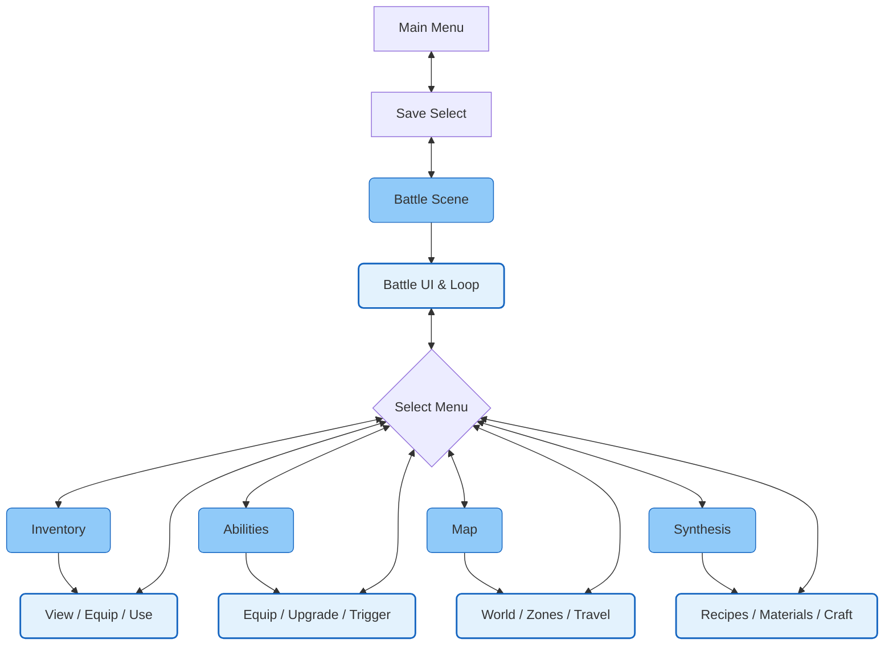

```mermaid
flowchart TD
    %% Core flow
    A[Main Menu] <--> B[Save Select]

    %% Battle (header + body)
    B <--> HB["Battle Scene"]:::header
    HB --> BB["Battle UI & Loop"]:::body
    BB <--> D{Select Menu}

    %% Inventory (header + body)
    D <--> HI["Inventory"]:::header
    HI --> BI["View / Equip / Use"]:::body
    BI <--> D

    %% Abilities (header + body)
    D <--> HF["Abilities"]:::header
    HF --> BF["Equip / Upgrade / Trigger"]:::body
    BF <--> D

    %% Map (header + body)
    D <--> HG["Map"]:::header
    HG --> BG["World / Zones / Travel"]:::body
    BG <--> D

    %% Synthesis (header + body)
    D <--> HH["Synthesis"]:::header
    HH --> BH["Recipes / Materials / Craft"]:::body
    BH <--> D

    %% Styles for header & body illusion
    classDef header fill:#90caf9,stroke:#1565c0,stroke-width:1px,rx:6,ry:6;
    classDef body   fill:#e3f2fd,stroke:#1565c0,stroke-width:2px,rx:6,ry:6;
```
