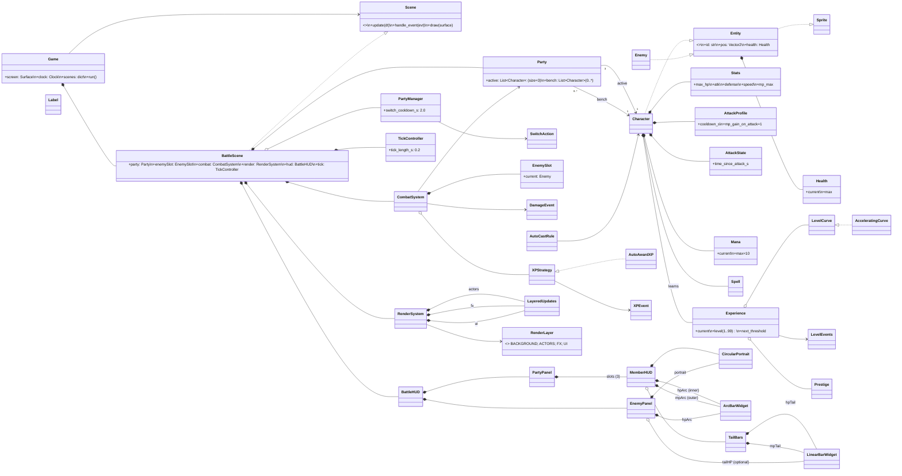
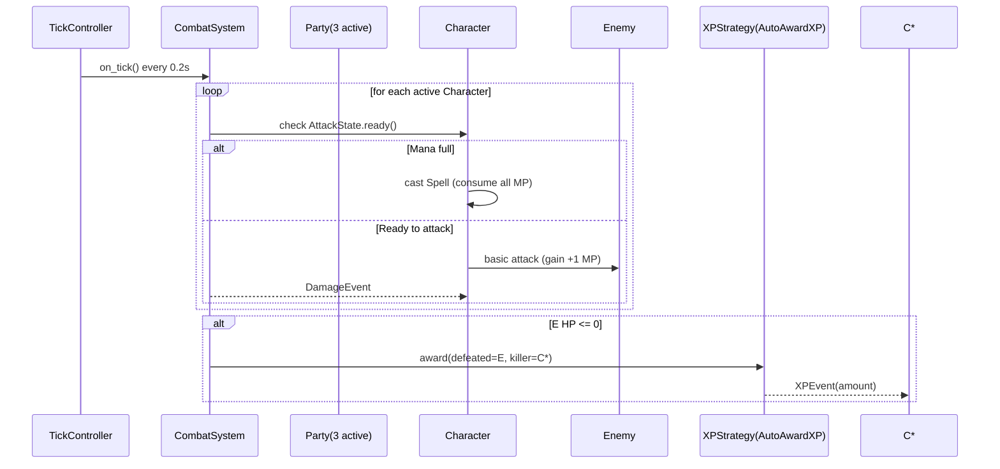
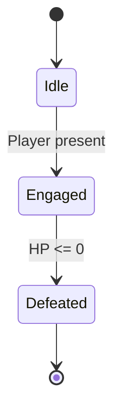

# Kingdom Hearts-Inspired Game Architecture (Python + Pygame)

This document defines the **UML architecture** for the game. It captures inheritance, composition, and associations in a pygame-aware model, with static battle presentation, XP/leveling, prestige, and save data.

## Legend

- `A <|-- B` : **Inheritance** — B is a subclass of A  
- `A *-- B` : **Composition** — A owns B, B’s lifecycle bound to A  
- `A o-- B` : **Aggregation** — A has B, but B can exist independently  
- `A --> B` : **Association/Dependency** — A depends on or uses B  

---
---

## Consolidated Class Diagram (pygame-aware)

---

## Sequence — Tick Attack / Auto‑Cast / XP

---

## State — Enemy Lifecycle

---

## Notes / Constraints
- **Party**: 3 active, bench unlimited. Benched do not act or gain XP.
- **Combat**: tick = 0.2s, attack cadence via `cooldown_s`. Damage = `max(1, ATK−DEF)`.
- **MP**: +1 per attack, max 10. When full, a Spell auto-casts and empties the bar.
- **Enemy**: single slot, portrait + circular HP arc. On defeat → replacement from `EnemyFactory`/`EncounterTable`.
- **XP**: only from enemy defeat drops, auto-awarded. Curve = accelerating quadratic, cap 99, prestige resets to level 1 with tokens and keeps spells.
- **Rendering**: pygame aware (`Entity ..|> Sprite`, RenderSystem with layered groups).
- **HUD**: Party on left, vertical; circular portraits with inner HP arc + outer MP arc + tail bars. Enemy on right with circular portrait + HP arc.
- **SaveData**: party composition, character snapshots (stats, xp, mana, spells), prestige, story flags. Inventory/depth later.
- **Inventory System**: add inventory mananagment with loadouts as well as leveling up equipment
- **Synthesis System** add sythesising different materials into potions and ether etc. as well as equipment
- **Combo System** quick time events on different abilities such as sonic blade and strike raid
- **World Select** Ability to go between worlds. Specific fourth party members on specific worlds. Multiple parties in different worlds???
- **AP system** AP collected over time ability loadout with AP
- **Drive system** add in drive and forms
- **Dive to the heart** add dive to the heart at the beginning of the game
- **Boss Batles** different functionality for boss battle. Add gimics to boss battles. bosses become able to idle after first victory.
- **Make a board** enemies on board move towards you
- **GUMMY SHIP** GUMMY SHIP
---